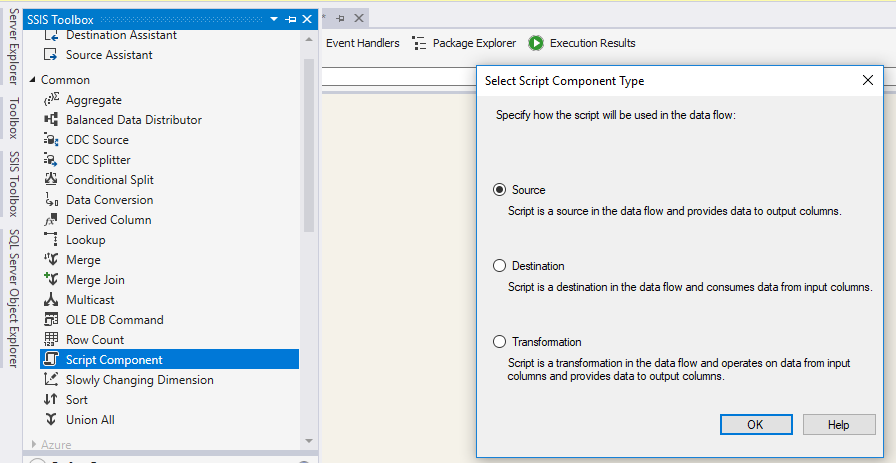
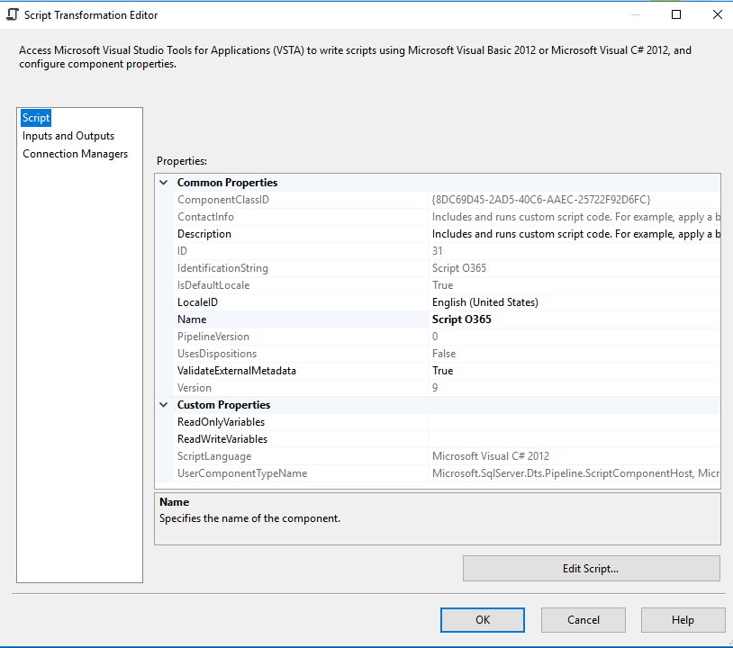
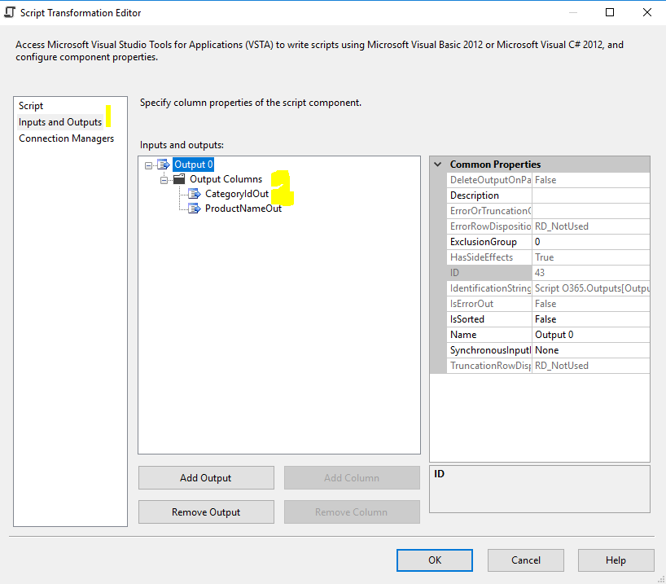
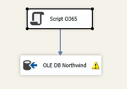

SSIS SharePoint Source

This post shows you how to use Office 365 SharePoint as data source in SSIS Data Flow.

Pre-requisite:

1. You already have basic knowledge on SSIS.

2. You have installed SharePoint SDK to your development environment [https://chanmingman.wordpress.com/2018/10/07/ssis-could-not-load-file-or-assembly-microsoft-sharepoint-client/](https://chanmingman.wordpress.com/2018/10/07/ssis-could-not-load-file-or-assembly-microsoft-sharepoint-client/)

3. SQL Server Data Tool is installed  [https://chanmingman.wordpress.com/2014/08/02/sql-server-data-tool-ssdt/](https://chanmingman.wordpress.com/2014/08/02/sql-server-data-tool-ssdt/).

4. You have Office 365 SharePoint online.

It used to have a codeplex SharePoint data source but it just didn&#39;t last for very long. A lot of people are still looking for a SSIS SharePoint data source. In this post, I will show you how to create a SSIS SharePoint Source with the combination of SharePoint SDK and Script Component in SSIS.

1. Create a SSIS project.

2. Drag **Data Flow Task** to **Control Flow** page. Double click the Data Flow Task. Drag **Script Component** to Data Flow page. When Select **Script Component Type** pops up then select **Source**.

 
 
3. Double click the Script Component. Click on **Inputs and Outputs.**

 

4. Expand the **Output 0**.Click the **Add Column**. In this example, I will add 2 output columns, CategoryIdOut and ProductNameOut.

5. Click the **Script**. Click **Edit Script…**

 

6. Replace the **CreateNewOutputRows** method with the following code. Of course, you need to change the siteUrl, password, and login name.

publicoverridevoid CreateNewOutputRows()

{

        string siteUrl = &quot;https://ming.sharepoint.com/sites/dev&quot;;

        ClientContext clientContext = new ClientContext(siteUrl);

        string password = &quot;password&quot;;

        SecureString securePassword = new SecureString();

        foreach (char c in password)

        {

                securePassword.AppendChar(c);

        }

        clientContext.Credentials = new SharePointOnlineCredentials(&quot;ming@ming.onmicrosoft.com&quot;, securePassword);

        SP.List oList = clientContext.Web.Lists.GetByTitle(&quot;ProductList&quot;);

        CamlQuery camlQuery = new CamlQuery();

        camlQuery.ViewXml = &quot;\&lt;View\&gt;\&lt;RowLimit\&gt;100\&lt;/RowLimit\&gt;\&lt;/View\&gt;&quot;;

        ListItemCollection collListItem = oList.GetItems(camlQuery);

        clientContext.Load(collListItem,

                items => items.Include(

                item => item.Id,

                item => item[&quot;CategoryId&quot;],

                item => item[&quot;ProductName&quot;]));

        clientContext.ExecuteQuery();

        foreach (ListItem oListItem in collListItem)

        {

                Console.WriteLine(&quot;ID: {0} \nId: {1} \nName: {2}&quot;, oListItem, oListItem.Id, oListItem[&quot;ProductName&quot;]);

                Output0Buffer.AddRow();

                Output0Buffer.ProductNameOut = oListItem[&quot;ProductName&quot;].ToString();

                Output0Buffer.CategoryIdOut = oListItem[&quot;CategoryId&quot;].ToString();

                }

}

7. Finally drag a OLE DB destination. For me, I am using the Northwind database, Products table.

 