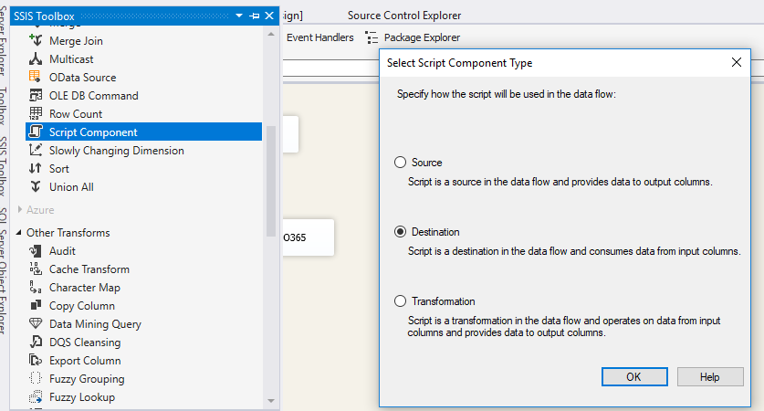

SSIS SharePoint Data Destination
This post shows you how to use Office 365 SharePoint as data destination in SSIS Data Flow.
Pre-requisite:
1. You already have basic knowledge on SSIS.
2. You have installed SharePoint SDK to your development environment https://chanmingman.wordpress.com/2018/10/07/ssis-could-not-load-file-or-assembly-microsoft-sharepoint-client/ 
3. SQL Server Data Tool is installed  https://chanmingman.wordpress.com/2014/08/02/sql-server-data-tool-ssdt/. 
4. You have Office 365 SharePoint online. 

A lot of people are still looking for a SSIS SharePoint data destination. In this post, I will show you how to create a SSIS SharePoint Source with the combination of SharePoint SDK and Script Component in SSIS.

1. Create a SSIS project.
2. Drag Data Flow Task to Control Flow page. Double click the Data Flow Task. Drag OLE DB Source. the Northwind database, Products table. You can create a Connect Manager to connect to the database.
3. Drag Script Component to Data Flow page. When Select Script Component Type pops up then select Destination.

3. Double click the Script Component. Click Edit Script…
4. Replace the Input0_ProcessInputRow method with the following code. Of course, you need to change the siteUrl, password, and login name.

public override void Input0_ProcessInputRow(Input0Buffer Row)
{
	string siteUrl = "https://chanmm.sharepoint.com/DevSite/";
	 ClientContext clientContext = new ClientContext(siteUrl);
	 clientContext.Credentials = SingIn.Login();
	SP.List oList = clientContext.Web.Lists.GetByTitle("NewList");
	ListItemCreationInformation itemCreateInfo = new ListItemCreationInformation();
	ListItem oListItem = oList.AddItem(itemCreateInfo);
	oListItem["Title"] = Row.ProductName;
	 oListItem.Update();
	clientContext.ExecuteQuery();
} 
